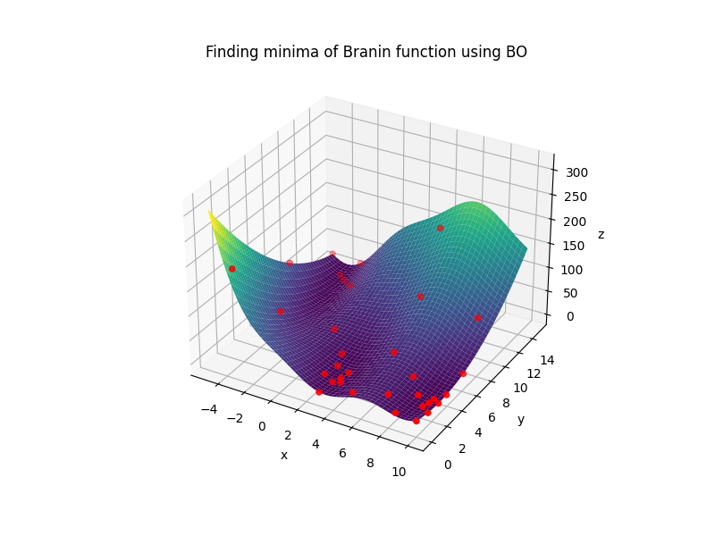
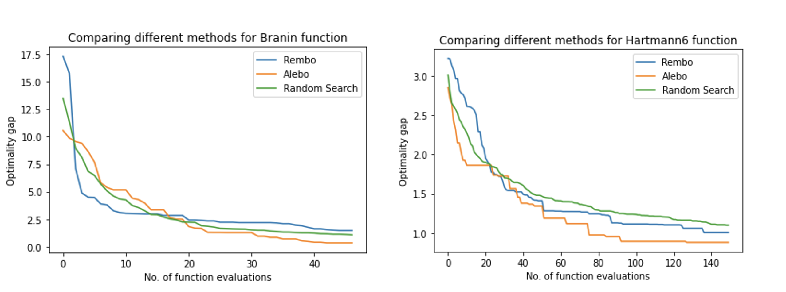

# pygpbo
Implementation and review of techniques to scale bayesian optimization to high dimensions.

[](https://circleci.com/gh/vaithak/pygpbo/tree/main)
[](https://codecov.io/gh/vaithak/pygpbo)

Example of running standard bayesian optimization on Branin function:
```python
# Reference: https://www.sfu.ca/~ssurjano/branin.html

import pygpbo
import numpy as np
def F(p1,p2,noise=0):
  return -(np.power((p2-5.1/(4*np.power(3.14,2))*np.power(p1,2)+5/3.14*p1-6),2)+10*(1-1/(8*3.14))*np.cos(p1)+10) + noise*np.random.randn()

bounds = {'p1': (-5, 10), 'p2': (0, 15)}

optimizer = pygpbo.BayesOpt(F, bounds)
optimizer.add_custom_points([{'p1': -4, 'p2': 1}, {'p1': -3, 'p2': 5},{'p1': 9, 'p2': 10},{'p1': 4, 'p2': 14}])

optimizer.maximize(n_iter=30)
print("Optimum point and value: ", optimizer.max_sample)


# Output seen: note that the optimum point can differ as branin has global minima at 3 different points
"""
Optimum point and value:  ({'p1': 9.474934424992359, 'p2': 2.373669396349481}, array([-0.43209275]))
"""
```
  

### Comparison of techniques for High Dimensional BO (mainly [ALEBO](https://arxiv.org/abs/2001.11659) and [REMBO](https://arxiv.org/abs/1301.1942))
  

